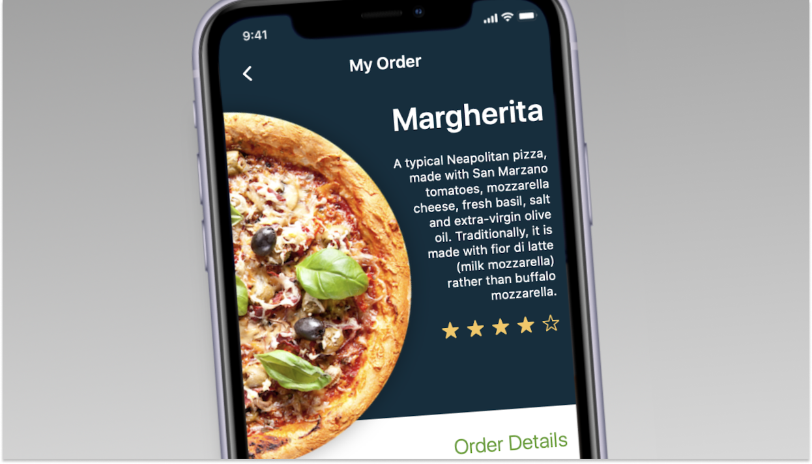

# User Experience

### A Swift Playground by Cristian Garske realized during May 2020.

## Introduction

In "User Experience", you'll help the developers of this this food app to improve their bad design, using the Human Interface Guidelines in 1 minute!

## What is Human Interface Guidelines?

Human Interface Guidelines aim to improve the experience for the users by making application interfaces more intuitive, learnable, and consistent. They're used across all Apple products!  HIGs often describe the visual design rules, including icon and window design and style.

## Installation

To experience "User Experience" yourself, download the zipped .playgroundbook file in this repository, and open it using Swift Playgrounds 3.3 or above for macOS. If this has helped you in any way, feel free to hit me up on LinkedIn or Instagram ;D.

## Demo

[YouTube](https://youtu.be/kPVHToiKMJM)

## Author

Hello, My name is Cristian Garske, I'm 29 years old, I'm a Design student at Universidade Federal do Rio Grande do Sul (UFRGS). I am a UX Design student at the Apple Developer Academy - Porto Alegre, Brazil. I started developing for iOS two years ago. Last year, I published my first app with a group of Apple Academy colleagues, at the App Store. The app is called Bubble Yonder and is aimed at facilitating the routines of children in the spectrum of autism. I did all the design part, and this playground is the first coding stuff i did, after watching a lot of Swift Classes last year and even online courses.

To find out more about me, visit my [LinkedIn](https://www.linkedin.com/in/cristiangarske/), [Instagram](https://www.instagram.com/oddghostly/) or my site [Cristian Garske](https://cristiangars.com).
